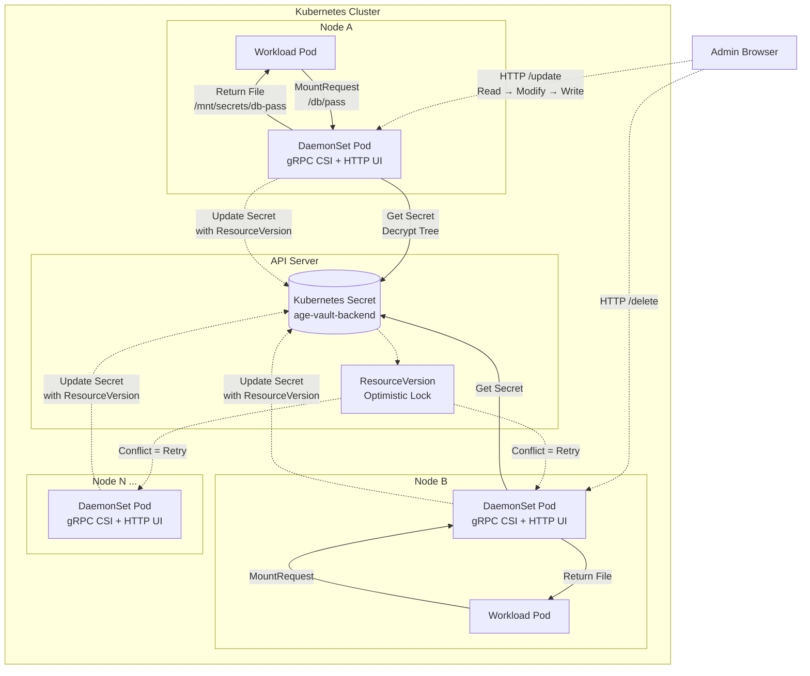

# Age-Encrypted Vault CSI Provider

A secure, zero-infrastructure Secrets Store CSI provider for Kubernetes. It stores your secrets in a centralized hierarchical tree, encrypts the entire tree using `filippo.io/age`, and persists it transparently as a standard Kubernetes Secret.

Designed for maximum security, it features an encrypted-at-rest backend, a secure locked state on startup, and hardware-level memory wiping using Go's `runtime/secret` experiment.

No external databases or heavy Vault installations are required.

## Features
* **Zero Infrastructure:** State is saved as an encrypted blob inside a standard Kubernetes Secret. Backing up your cluster naturally backs up your secrets.
* **Cold Start / Lock Mode:** The provider starts in a "Locked" state. It can be unlocked manually via the Web UI, via an environment variable, or seamlessly via Cloud KMS integrations.
* **Granular Access Control:** Define exactly which Namespaces and ServiceAccounts can read specific paths in your secret tree.
* **Web UI JWT Permissions:** In production (non-dev mode), the Web UI can enforce JWT-based RBAC so users only see and manage the parts of the tree they own.
* **Modern Cryptography:** Powered by the modern, secure `filippo.io/age` encryption standard.
* **Cloud KMS Ready:** Extensible `MasterKeyProvider` interface allows fetching the master unlock key from AWS KMS, GCP KMS, or Azure KeyVault.
* **Memory Safe:** Built using Go 1.24+ `runtime/secret` experiment. All decryption, JSON parsing, and string manipulation happen inside a secure execution enclave. Plaintext secrets are strictly zeroed out from heap memory when no longer needed.

---

## Architecture & Lifecycle

1. **Deployment:** The CSI provider is deployed as a DaemonSet. If no Master Key is provided, it starts in **Locked** mode.
2. **Unlocking:** An administrator provides the Master Key via the local Web UI, or the system auto-fetches it via a Cloud KMS plugin.
3. **Administration:** Using the local Web UI, administrators can blind-write new secrets and define Access Control Lists (ACLs). The Web UI masks all values and strips plaintext before rendering HTML to prevent memory leaks.
4. **Encryption:** The Provider serializes and encrypts the tree using the `age` public key, storing it in `kube-system/age-vault-backend`.
5. **Concurrent-Safe Writes:** The Web UI and any write path use optimistic locking (`ResourceVersion`) on the Kubernetes Secret. If multiple pods (or multiple users) try to update the vault simultaneously, the first one succeeds and the others automatically retry their read-modify-write cycle up to 5 times. This prevents lost updates when running multiple DaemonSet replicas per node.
6. **Mounting:** When a Pod requests a secret, the Provider dynamically decrypts the Vault Tree *in-memory*, evaluates the ACL against the requesting Pod's Namespace/ServiceAccount, and securely mounts the secret into the Pod.



---

## Prerequisites

1. Kubernetes cluster.
2. The [Secrets Store CSI Driver](https://secrets-store-csi-driver.sigs.k8s.io/) installed:
   ```bash
   helm repo add secrets-store-csi-driver https://kubernetes-sigs.github.io/secrets-store-csi-driver/charts
   helm install csi-secrets-store secrets-store-csi-driver/secrets-store-csi-driver --namespace kube-system --set syncSecret.enabled=true
   ```
3. `age` CLI installed locally to generate your master key (`brew install age` or `apt install age`).

---

## Installation & Unlocking

### 1. Generate a Master Key
Generate an `age` key pair. This is the master key the CSI provider will use to encrypt and decrypt the storage backend.
```bash
age-keygen -o key.txt
cat key.txt
# Public key: age1...
# AGE-SECRET-KEY-1...
```
*Keep this key safe! If you lose it, your vault cannot be recovered.*

### 2. Deploy the CSI Provider
Apply the RBAC and DaemonSet manifests.
```bash
kubectl apply -f deploy.yaml
```
Verify the daemonset is running:
```bash
kubectl get pods -n kube-system -l app=age-vault-csi
```

> **Note on Multiple Replicas:** The DaemonSet can safely run multiple provider pods per node. All instances share the same encrypted Kubernetes Secret backend. The built-in optimistic locking (`ResourceVersion` retries) ensures that concurrent writes from different pods (or concurrent UI sessions) never overwrite each other.

### 3. Unlock the Vault via Web UI
By default, the provider starts in **Locked** mode. Pods trying to mount secrets will hang in the `ContainerCreating` state until the vault is unlocked.

Port-forward the Admin API:
```bash
kubectl port-forward -n kube-system ds/age-vault-csi 8090:8090
```
1. Open http://localhost:8090 in your browser.
2. You will see the **Vault Locked 🔒** screen.
3. Paste your `AGE-SECRET-KEY-...` into the form and click **Unlock**.

*(Note: You can also choose to mount the master key as an environment variable `MASTER_KEY` or implement the `MasterKeyProvider` interface to fetch it from a Cloud KMS automatically on boot).*

### 4. (Optional) Unlock via Cloud KMS

Instead of storing the master key in a Kubernetes Secret, you can encrypt it with a cloud KMS and let the provider fetch it at startup. This requires building with the appropriate build tag.

| Cloud | Build Tag | Guide |
|-------|-----------|-------|
| AWS KMS | `kms` | [README_AWS.md](README_AWS.md) |
| GCP Cloud KMS | `gcpkms` | [README_GCP.md](README_GCP.md) |

Both providers can be enabled simultaneously with `-tags "kms,gcpkms"`. The cloud SDK dependencies live in separate Go modules (`awskms/`, `gcpkms/`) and are never pulled into the base binary unless the build tag is active.

---

## Web UI User Permissions (Production)

When running in a real cluster (i.e. **not** `DEV_MODE=true`), you can enforce JWT-based access control on the Web UI. This ensures users only see, create, update, or delete secrets within the branches they are allowed to access.

### 1. Create a `perm.yaml` ConfigMap

```yaml
apiVersion: v1
kind: ConfigMap
metadata:
  name: age-vault-perms
  namespace: kube-system
data:
  perm.yaml: |
    userA:
      - "/nats/*"
      - "/postgresql/*"
    userB:
      - "/app/*"
    admin:
      - userH
```

Rules:
- Each user gets a list of path patterns. Patterns support exact paths (`/db/postgres/password`) and prefix wildcards (`/nats/*`).
- The `admin` list contains usernames that have full access to **all** secrets and can perform exports.
- Only admins can click **Export Backup (.age)**.

### 2. Provide the JWT public key

The Web UI validates incoming `Authorization: Bearer <token>` headers using an RSA public key. Store it in a Secret:

```yaml
apiVersion: v1
kind: Secret
metadata:
  name: jwt-public-key
  namespace: kube-system
stringData:
  JWT_PUBLIC_KEY: |
    -----BEGIN PUBLIC KEY-----
    MIIBIjANBgkqhkiG9w0BAQEFAAOCAQ8AMIIBCgKCAQEA...
    -----END PUBLIC KEY-----
```

### 3. Wire the environment variables

The DaemonSet in `deploy.yaml` already includes the volume mounts and env vars:

```yaml
env:
  - name: PERM_CONFIG_PATH
    value: /etc/age-vault/perm.yaml
  - name: JWT_PUBLIC_KEY
    valueFrom:
      secretKeyRef:
        name: jwt-public-key
        key: JWT_PUBLIC_KEY
  - name: JWT_USER_CLAIM
    value: "sub"  # default; the JWT claim to use as the username
```

When these are set, every request to the Web UI must include a valid `Authorization: Bearer <jwt>` token. The UI will then only show folders and secrets the user is allowed to read.

> **Tip:** In `DEV_MODE=true`, the permission system is **not** enforced. The Web UI remains open so you can develop and test without generating JWTs.

---

## Securing the Admin UI

The built-in HTTP admin UI is designed for simplicity and does not implement TLS termination, CSRF protection, or security headers itself. In production, you are responsible for securing access to the admin port (`8090`). The recommended approach is to place a reverse proxy, ingress controller, or API gateway in front of the UI.

### Recommended setup

Do **not** expose the admin port directly on the node network. Instead:

1. **Remove the Service from `deploy.yaml`** (the DaemonSet uses `hostNetwork: true`, so no Service is needed for internal CSI gRPC).
2. **Port-forward for local access** with `kubectl port-forward -n kube-system ds/age-vault-csi 8090:8090` and access via `https://localhost:8090`.
3. **Or, place a reverse proxy in front** if remote browser access is required:

```yaml
apiVersion: v1
kind: Service
metadata:
  name: age-vault-admin
  namespace: kube-system
spec:
  selector:
    app: age-vault-csi
  ports:
    - port: 443
      targetPort: 8090
```

Then use an ingress or gateway (e.g., NGINX Ingress, Istio, Ambassador, Traefik) that provides:

| Concern | Gateway Responsibility |
|---------|----------------------|
| **TLS termination** | Terminate HTTPS at the gateway. Never expose the admin UI over plaintext HTTP on the node network. |
| **CSRF protection** | Validate `Origin`/`Referer` headers, inject CSRF tokens, or require a custom header (e.g., `X-Requested-With`). |
| **Security headers** | Inject `Strict-Transport-Security`, `X-Content-Type-Options: nosniff`, `X-Frame-Options: DENY`, `Content-Security-Policy`, and `Referrer-Policy`. |
| **Rate limiting** | Apply request rate limits on `/unlock` to prevent brute-force attempts. |
| **Authentication** | Optionally add an additional authentication layer (OAuth2, OIDC) before traffic reaches the UI's JWT middleware. |

### Authentication

When `PERM_CONFIG_PATH` and `JWT_PUBLIC_KEY` are configured, the UI's built-in JWT middleware enforces access control. When they are **not** set, the UI is completely open — anyone with network access to port 8090 can read, write, and delete secrets, and can attempt to unlock the vault. Always configure JWT authentication in production, even behind a reverse proxy.

---

## Managing Secrets (Web UI)

Once unlocked, the Web UI at http://localhost:8090 becomes your control plane.

* **View ACLs:** See which namespaces and service accounts have access to which vault paths.
* **Blind-Write Interface:** For security, secret values cannot be read back from the UI. They are displayed as `********`.
* **Add/Update Secrets:** Use the form to insert new secrets or update existing ones. Example path: `/db/postgres/password`.
* **Offline Backups:** Admins can click **Export Backup (.age)** to download the entire vault securely. Because the export is `age`-encrypted, it is completely safe to store in version control, S3, or a local hard drive.

---

## Usage: Mounting Secrets in Pods

Now that the Vault is unlocked and populated, developers can mount secrets into their pods using a `SecretProviderClass`.

### 1. Define the SecretProviderClass
Tell the CSI driver which paths from the Vault you want to fetch:
```yaml
apiVersion: secrets-store.csi.x-k8s.io/v1
kind: SecretProviderClass
metadata:
  name: app-secrets
  namespace: production
spec:
  provider: agevault
  parameters:
    # Format: "filename_to_mount=/vault/path, next_file=/next/path"
    secrets: "db-pass=/db/postgres/password, stripe-key=/api/stripe/key"
```

### 2. Mount into a Pod
Reference the `SecretProviderClass` in your Pod's volumes:
```yaml
apiVersion: v1
kind: Pod
metadata:
  name: my-secure-app
  namespace: production
spec:
  serviceAccountName: db-client # Must match the ACL in the Vault Tree!
  containers:
  - name: app
    image: alpine
    command: ["sleep", "3600"]
    volumeMounts:
    - name: secrets-store
      mountPath: "/mnt/secrets"
      readOnly: true
  volumes:
  - name: secrets-store
    csi:
      driver: secrets-store.csi.k8s.io
      readOnly: true
      volumeAttributes:
        secretProviderClass: "app-secrets"
```

When the pod starts:
1. If the vault is locked, the Pod will wait safely in `ContainerCreating`.
2. Once unlocked, the CSI driver verifies that `production` and `db-client` are allowed to read `/db/postgres/password`.
3. If successful, the plaintext secret is mounted as a file at `/mnt/secrets/db-pass`.

## End-to-End Testing

A self-contained e2e test suite is included in `e2e/e2e_test.go`. It validates the entire stack by spinning up a real [kind](https://kind.sigs.k8s.io/) cluster, building the provider image, deploying the driver, installing the Secrets Store CSI Driver, and verifying that secrets can be mounted into a pod.

### Prerequisites

- `kind`
- `helm`
- `kubectl`
- `docker` or `podman` (auto-detected; override with `CONTAINER_RUNTIME=podman`)

### Run the E2E tests

```bash
go test -tags e2e ./e2e -run TestE2E -count=1 -v
```

What happens under the hood:

1. **Create a Kind cluster** (`csi-secret-age-cluster`).
2. **Build the image** (`csi-secret-age:e2e`) and load it into the cluster.
3. **Deploy the driver** — RBAC, a throwaway `age` master key Secret, and the DaemonSet.
4. **Install the Secrets Store CSI Driver** via Helm with the provider path configured.
5. **Run smoke tests** — verify the driver is registered and the gRPC socket is alive.
6. **Run mounting validation** — add a secret via the HTTP admin API, create a `SecretProviderClass`, mount it into a `busybox` pod, and read the file back to confirm the secret was delivered.

### Useful options

```bash
# Keep the cluster alive after the test for debugging
SKIP_TEARDOWN=true go test -tags e2e ./e2e -run TestE2E -count=1 -v

# Force a specific container runtime
CONTAINER_RUNTIME=podman go test -tags e2e ./e2e -run TestE2E -count=1 -v
```

---

## Advanced Security: Hardware Memory Wiping

This project takes advantage of the experimental `runtime/secret` package introduced in Go.

When compiled with `GOEXPERIMENT=runtimesecret` (see the `AGENTS.md`):
1. **Secure Enclave Execution:** All JSON unmarshaling, `age` decryption, and string allocation for secrets happen inside a protected `secret.Do(func(){})` context.
2. **Guaranteed Heap Wiping:** The Go Garbage Collector guarantees that the memory pages holding your plaintext secrets are **zeroed out** as soon as the gRPC mount response is sent.
3. **Template Protection:** The Web UI HTML template renderer only ever receives stripped structs. The plaintext secrets never accidentally escape onto the heap where the HTTP server could leave them lingering in memory.

This completely prevents secrets from lingering in memory space, protecting against memory dumping attacks (e.g., via compromised container host or core dumps).
